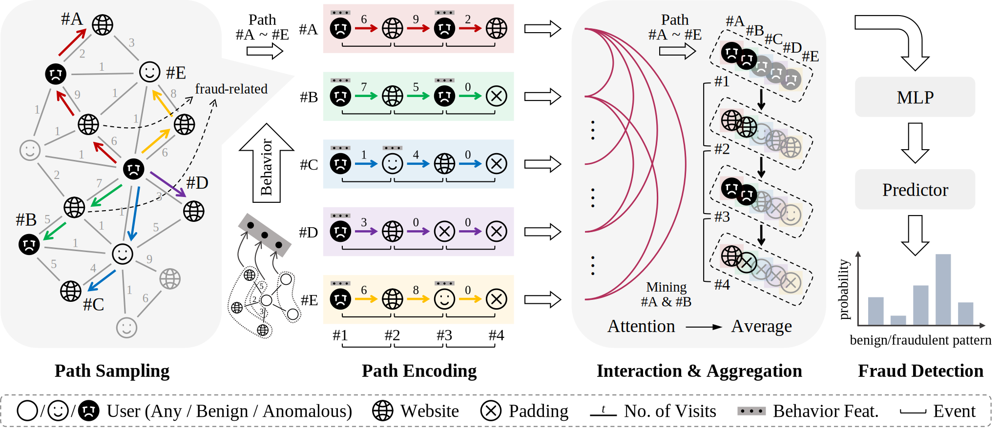

Association-Focused Path Aggregation for Graph Fraud Detection
========

[](https://neurips.cc/Conferences/2025)
&emsp;[](https://github.com/horrible-dong/QTClassification)
&emsp;[](README.md)
&emsp;[](LICENSE)

> Authors: Tian Qiu, Wenda Li, Zunlei Feng, Jie Lei, Tao Wang, Yi Gao, Mingli Song, Yang Gao  
> Affiliation: Zhejiang University  
> [[Paper]](https://openreview.net/pdf?id=TiE8aTc3Zg) | [[Poster]](poster.pdf) | [[Dataset (百度网盘)]](https://pan.baidu.com/s/1FCfnnkkxZuFU79lUan2Xvw?pwd=gfds) | [[Dataset (Google Drive)]](https://drive.google.com/file/d/1fT8f2E9R9BfC-rxCnXMSAkSPIDgMXIGt/view?usp=sharing)

## Abstract

Fraudulent activities have caused substantial negative social impacts and are exhibiting emerging characteristics such
as intelligence and industrialization, posing challenges of high-order interactions, intricate dependencies, and the
sparse yet concealed nature of fraudulent entities. Existing graph fraud detectors are limited by their narrow
"receptive fields", as they focus only on the relations between an entity and its neighbors while neglecting
longer-range structural associations hidden between entities. To address this issue, we propose a novel fraud detector
based on Graph Path Aggregation (GPA). It operates through variable-length path sampling, semantic-associated path
encoding, path interaction and aggregation, and aggregation-enhanced fraud detection. To further facilitate
interpretable association analysis, we synthesize G-Internet, the first benchmark dataset in the field of internet fraud
detection. Extensive experiments across datasets in multiple fraud scenarios demonstrate that the proposed GPA
outperforms mainstream fraud detectors by up to +15% in Average Precision (AP). Additionally, GPA exhibits enhanced
robustness to noisy labels and provides excellent interpretability by uncovering implicit fraudulent patterns across
broader contexts.



## Installation

The development environment of this project is `python 3.8 & pytorch 1.13.1+cu117 & dgl 1.1.3+cu117`.

1. Create your conda environment.

```bash
conda create -n qtcls python==3.8 -y
```

2. Enter your conda environment.

```bash
conda activate qtcls
```

3. Install PyTorch.

```bash
pip install torch==1.13.1+cu117 torchvision==0.14.1+cu117 --extra-index-url https://download.pytorch.org/whl/cu117
```

Or you can refer to [PyTorch](https://pytorch.org/get-started/previous-versions/) to install newer or older versions.
Please note that if pytorch ≥ 1.13, then python ≥ 3.7.2 is required.

4. Install DGL.

```bash
pip install dgl==1.1.3+cu117 -f https://data.dgl.ai/wheels/cu117/repo.html
```

(optional) Add environment variables in `~/.bashrc`.

```bash
export DGLBACKEND="pytorch"
```

5. Install CUDA.

```bash
wget https://developer.download.nvidia.com/compute/cuda/11.7.1/local_installers/cuda_11.7.1_515.65.01_linux.run
sh cuda_11.7.1_515.65.01_linux.run
```

Add environment variables in `~/.bashrc`.

```bash
export PATH=/path/to/cuda/bin:$PATH
export LD_LIBRARY_PATH=/path/to/cuda/lib64:$LD_LIBRARY_PATH
```

6. Install necessary dependencies.

```bash
pip install -r requirements.txt
```

## Data Preparation

1. Download `graph_fraud_datasets.zip` from [[百度网盘]](https://pan.baidu.com/s/1FCfnnkkxZuFU79lUan2Xvw?pwd=gfds) / [[Google Drive]](https://drive.google.com/file/d/1fT8f2E9R9BfC-rxCnXMSAkSPIDgMXIGt/view?usp=sharing) and put the file into `data/raw`.

2. Unzip the file.

```bash
cd data/raw
unzip graph_fraud_datasets.zip
cd ../..
```

## Training

Import the config file (.py) from [configs](configs).

```bash
python main.py --config /path/to/config.py
```

or

```bash
python main.py -c /path/to/config.py
```

During training, the config file, checkpoints (.pth), logs, and other outputs will be stored in `--output_dir`.

## Evaluation

```bash
python main.py --config /path/to/config.py --resume /path/to/checkpoint.pth --eval
```

or

```bash
python main.py -c /path/to/config.py -r /path/to/checkpoint.pth --eval
```

## License

Our code is released under the Apache 2.0 license. Please see the [LICENSE](LICENSE) file for more information.

Copyright (c) QIU Tian and ZJU-VIPA Lab. All rights reserved.

Licensed under the Apache License, Version 2.0 (the "License"); you may not use these files except in compliance with
the License. You may obtain a copy of the License at http://www.apache.org/licenses/LICENSE-2.0.

Unless required by applicable law or agreed to in writing, software distributed under the License is distributed on an
"AS IS" BASIS, WITHOUT WARRANTIES OR CONDITIONS OF ANY KIND, either express or implied. See the License for the specific
language governing permissions and limitations under the License.

## Citation

If you find the paper useful in your research, please consider citing:

```bibtex
@inproceedings{gpa,
  title={Association-Focused Path Aggregation for Graph Fraud Detection},
  author={Qiu, Tian and Li, Wenda and Feng, Zunlei and Lei, Jie and Wang, Tao and Gao, Yi and Song, Mingli and Gao, Yang},
  booktitle={Advances in Neural Information Processing Systems},
  year={2025}
}
```
